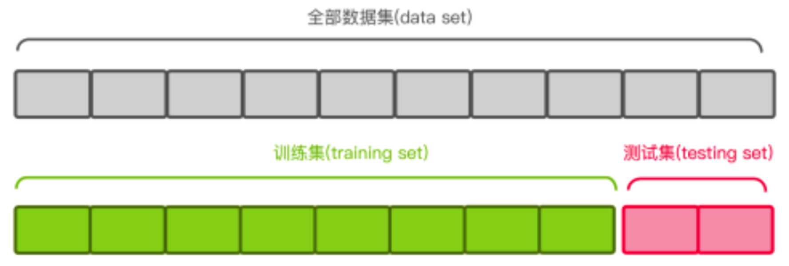
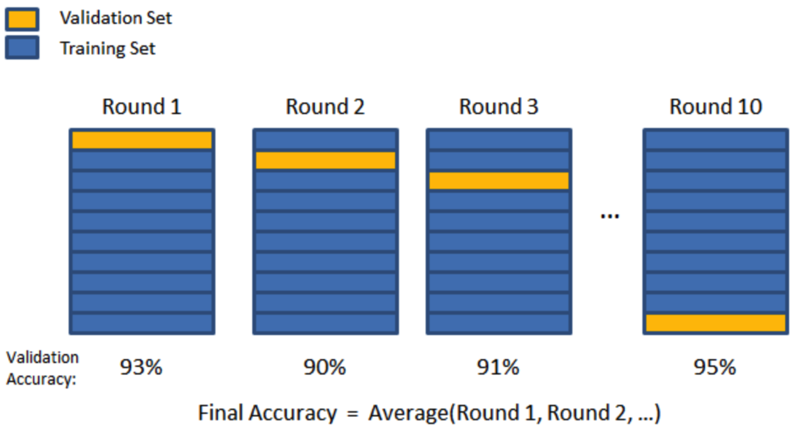

## task5
任务5：使用网格搜索法对5个模型进行调优（调参时采用五折交叉验证的方式），
并进行模型评估，记得展示代码的运行结果。 

* 网格搜索法 \
Grid Search：一种调参手段：穷举搜索，在所有候选的参数选择中，通过循环遍历，尝试每一种可能性，表现最好的就是最终的记过。其原理就像是在数组里找最大值。（为什么叫网格搜索？以有两个参数的模型为例子，参数a有两种可能，参数b有4种可能，把所有可能性列出来，可以表示成一个3*4的表格，其中每个cell就是一个网格，循环过程中就像是在每个网格里、遍历、搜索、所以叫grid search）

* 交叉验证与网格搜索  
网格搜索（Grid Search）名字非常大气，但是用简答的话来说就是你手动的给出一个模型中你想要改动的所用的参数，程序自动的帮你使用穷举法来将所用的参数都运行一遍。决策树中我们常常将最大树深作为需要调节的参数；AdaBoost中将弱分类器的数量作为需要调节的参数。

* 评分方法 \
为了确定搜索参数，也就是手动设定的调节的变量的值中，哪一个是最好的，这时就需要使用一个比较理想的评分方式（这个评分方式是根据实际情况来确定的可能是accuracy、f1、f-beta、p、r）

* 交叉验证\
有了好的评分方式，但是只用一次的结果就能说明某组的参数组合比另外的参数组合好吗？这显然是不严谨的，上小学的时候老师就告诉我们求平均的概念，所以就有了交叉验证这一概念，下面以K折交叉验证为例介绍这一概念 
1. 首先进行数据分割\
将原始数据集氛围训练集和测试集，如下以8:2的方式分割\

训练集用于模型的训练，测试集也为验证集合，用于测试模型的准确率\
注意：绝对不能使用测试集来训练数据，这相当于考试的时候先让你吧考试答案背过了，又让你参加考试

2. 数据验证\
在K折交叉验证方法中，其中K-1作为训练数据，剩下的一份作为验证数据

这个过程一共需要进行K次，将最后K次使用 选择好的评分方式求平均返回，然后找出最大的评分对用的参数组合，这也就完成了交叉验证的这一过程

缺点很直观，就是耗时