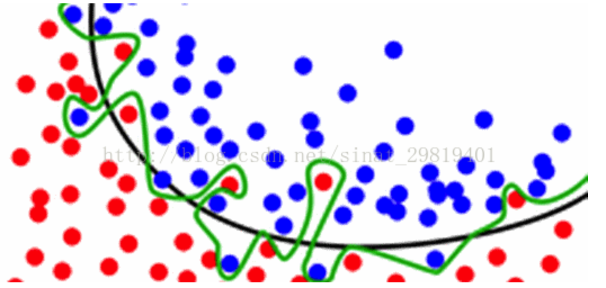
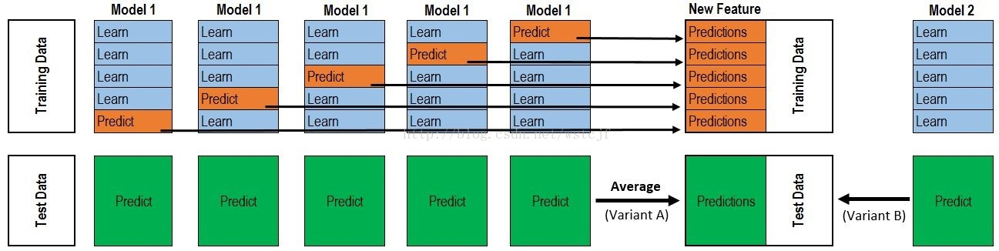

## task6: 模型融合
模型融合方式任意，并结合Task5给出你的最优结果。
例如Stacking融合，用你目前评分最高的模型作为基准模型，和其他模型进行stacking融合，得到最终模型及评分结果。

构建并结合多喝学习器来完成学习任务，我们把它称为模型融合或者集成学习。
不同的模型有各自的长处，具有差异性，而模型融合可以使得发挥各个模型的优势，让这些相对较弱的模型（学习器）通过某种策略结合起来，达到比较强的学习器

* 结果文件中融合
最简单便捷的方式就是从竞赛的提交结果文件中进行融合，因为这样做并不需要重新训练模型，只需要把不同模型的测试结果弄出来，然后采取某种措施得出一个最终结果就ok

1. 多数表决融合\
首先证明一下为什么模型融合能够提高准确率，以及对低相关的结果进行融合可以获得更好的结果。\
用一个概率的例子来说明，加入现在有10条记录，每条记录能被正确分类的概率为70%，或者某个模型对这10条记录进行分类能获得70%的准确率，现在拟合三个相当的模型，采用多数表决的情况下，对每条记录，三个模型都判断正确的概率为$0.7*0.7*0.7=0.34$，两个模型判断正确的概率为$*C_{3}^2*0.7*0.7*0.3=0.44$，那么通过三个准确率为0.7的模型来融合的话，理论上最终每条记录能被正确分类的概率提升到0.78\
周志华教授在他的著作《机器学习》提到，结果的差异越高，最终模型融合出来的结果也会越好。同样用一个简单的例子来说明：接着上面的话题，假设现在三个模型预测出来的结果是：\
model1：1111111100 = 80% 准确率\
model2：1111111100 = 80% 准确率\
model3：1011111100 = 70% 准确率\
如果把这三个模型结果用多数表决组合起来，那么最终结果是：1111111100 = 80% ，这个结果跟第一、第二个模型是一致的，也就是，这样本的模型融合对最终的结果没有任何的提升。\
假设我们把三个模型的结果改为：\
model1：1111111100 = 80% 准确率\
model2：0111011101 = 70% 准确率\
model3：1000101111 = 60% 准确率\
显然这三个模型之间的差异更大，而且表面来看性能不如前面提到的三个模型，但他们融合出来的结果是：1111111101 = 90% 准确率！\

2. 加权表决融合\
多数表决的融合方式默认了所有模型的重要度是一样的，但通常情况下我们会更重视表现比较好的模型而需要赋予更大的全职，在加权表决的情况下，表现较差的模型只能通过与其他模型一样的结果来增强自己的说服力

3. 对结果取平均\
对结果取平均在很多机器学习问题上以及不同的评估准则上都获得很不错的结果。\
取均值的做法常常可以减少过拟合现象，在机器学习的应用中，过拟合现象是很普遍的，根本问题是训练数据量不足以支持复杂的模型，导致模型学习到的数据集上的噪音，这样产生的问题是模型很难泛化，因为模型考虑得过分片面\
但如果对结果取平均，可以在一定程度上减轻过拟合现象。途中所示，单个模型因为过拟合长生了绿色的决策边界，但事实上黑色的决策边界因为有更好的泛化能力从而有更好的效果，如果通过拟合多个模型对模型结果取平均，对这些噪音点的考虑就会因为结果拉平均的原因而减少，决策边界也会慢慢的往黑色线靠近。

\
记住，机器学习的目的并不是让模型记住训练数据，而是对未知的数据有更好的推广

### Stacking & Blending
* Stacking\
Stacking的过程如下：

对上图过程进行解释，上半部分是用一个基础模型进行5折交叉验证，如：用XGBoost作为基础模型model1，5折交叉验证就是先拿出四折作为training data，另外一个折作为Validation set。注意：在stacking中此部分数据会用到整个traing set。\
如：假设我们整个training set包含10000行数据，testing set包含2500行数据，那么每一次交叉验证其实局势training set进行划分，在每一次的交叉验证中training data 将会是8000行，Validation data是2000行。\
每一次交叉验证包含两个过程，1.基于training data训练模型；2.基于training data训练生成的模型对Validation进行预测，在整个第一次的交叉验证完成之后，我们将会得到关于当前Validation data的预测值，这将会是一个一维2000行的数据，即为a1。注意！在这部分操作完成后，还要对数据集的整个test set（2500行的数据）进行预测！，这个过程会产生2500个预测值，这部分的预测值将会作为下一层模型testing的一部分，记为b1。因为我们进行的是5折交叉验证，所以以上提及的过程将会进行5次，最终回程针对Validation data 数据预测的5个2000行的数据a1，a2，a3，a4，a5，对testing set的预测会是5个2500行数据的b1，b2，b3，b4，b5。\
在完成对Model1的整个步骤之后，我们可以发现a1，a2，a3，a4，a5，其实就是对原来整个training set的预测值，将他们拼凑起来，会形成一个10000行的矩阵，即为A1，而对于b1，b2，b3，b4，b5这部分数据，我们将各部分相加取他们的平均值，得到一个2500行一列的矩阵，记为B1。\
以上就是stacking中一个模型的完整流程，stacking中同一层通常包含多个模型，假设还有Model2:LR,Model3:RF,Model4:GBDT,Model5:SVM，对于这四个模型，我们可以重复以上的步骤，在整个流程结束之后，我么你可以得到新的A2,A3,A4,A5矩阵。\
在此之后，我们把A1,A2,A3,A4,A5并列合并得到一个10000行5列的矩阵作为training data，B1,B2,B3,B4,B5并列得到一个2500行5列的矩阵作为testing data。让下一个层模型，基于他们进一步训练

* Blending：其实是Stacking中的一个A1的过程
1. Uniform Blending（均匀融合）\
Uniform Blending的分类模型如下，实际上就是少数服从多数据的原则，类似与投票：
$$G(x)=sign(\sum_{t=1}^T1\cdot g_t(X))$$
回归模型如下，直接求T个模型g的结果的平均值：
$$G(x) = \frac{1}{T}\sum_{t=1}^T1\cdot g_t(X)$$
通过Uniform Blending 可以减少varience。\
分类问题可以想想为投票，回归问题可以想象为加权

2. Linear Blending（线性融合）
上面的Uniform Blending，对于每一个模型，无论是回归还是分类，他们的权重是一样的，但是我们稍加改变，为每一个基分类器g都指定权重。
$$ G(x)=sign(\sum_{t=1}^T\alpha_t\cdot g_t(X))$$
其中，
$\alpha_t$大于等于0，那么这些g是由最小化评价集合的最小误差得到的，然后通过“特征转化”，
$Z_n =G^{-}(X_{n}) = (g_{1}^-(x_{n}),g_{2}^-(x_{n}),g_{3}^-(x_{n}),...g_{T}^-(x_{n}))$，数据变为$(z_{n},y_{n})$；而$\alpha_t$通过之前的线性回归，逻辑回归等方法得到投票权重；最后便得到了最终的模型

